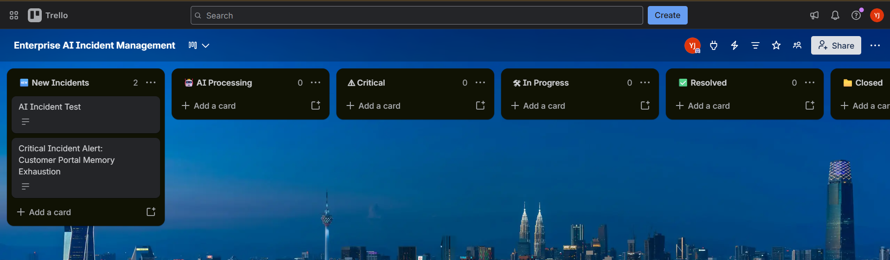
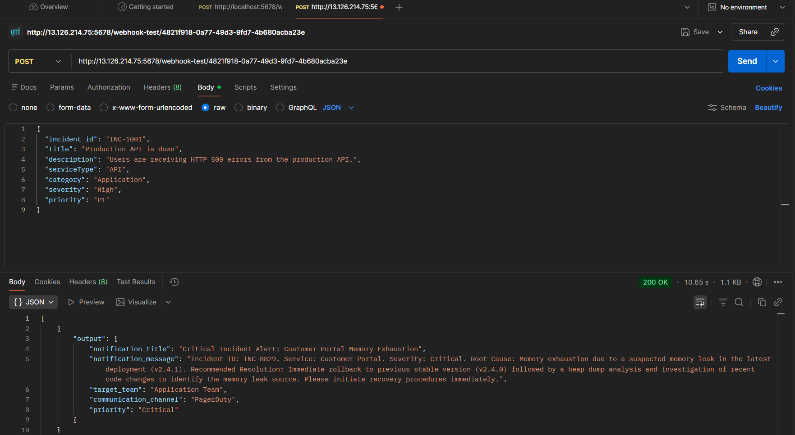

<div align="center">

# 🚀 Enterprise AI Incident Resolution Platform

### Intelligent Multi-Agent AI Platform for Enterprise IT Incident Management

<p align="center">


</p>

An end-to-end Enterprise AI Platform that combines a modern React dashboard with a Multi-Agent AI backend to automate enterprise incident analysis, knowledge retrieval, root cause detection, and incident management using Google Gemini, Pinecone RAG, n8n, Docker, and AWS EC2.

</div>

---

# 🎯 Project Overview

Enterprise IT teams often spend significant time manually investigating incidents, searching documentation, identifying root causes, and coordinating responses.

This platform automates the complete incident resolution lifecycle using a Multi-Agent AI architecture.

The system includes:

- 🖥 Modern React Dashboard
- 🤖 Multi-Agent AI Workflow
- 🧠 Google Gemini AI
- 📚 Pinecone RAG Knowledge Retrieval
- 📋 Automatic Trello Ticket Creation
- 🌐 REST API
- 🐳 Docker Deployment
- ☁ AWS EC2 Deployment

---

# ✨ Key Features

| Feature | Status |
|---------|--------|
| React Dashboard | ✅ |
| Incident Management | ✅ |
| AI Resolution History | ✅ |
| Incident Analytics | ✅ |
| Multi-Agent AI | ✅ |
| Google Gemini | ✅ |
| Pinecone RAG | ✅ |
| Semantic Search | ✅ |
| Root Cause Analysis | ✅ |
| Hallucination Detection | ✅ |
| Resolution Recommendation | ✅ |
| Trello Integration | ✅ |
| REST API | ✅ |
| Docker Deployment | ✅ |
| AWS EC2 Deployment | ✅ |

---

# 🏗 System Architecture

```text
                     User
                       │
                       ▼
              React Dashboard
                       │
                  Axios REST API
                       │
                       ▼
          Enterprise AI Orchestrator (n8n)
                       │
 ┌─────────────────────────────────────────────┐
 │ Agent 1 - Incident Classification           │
 │ Agent 2 - Severity Assessment               │
 │ Agent 3 - Knowledge Retrieval (Pinecone)    │
 │ Agent 4 - Root Cause Analysis               │
 │ Agent 5 - Resolution Recommendation         │
 │ Agent 6 - Notification Generation           │
 │ Agent 7 - Knowledge Evaluation              │
 │ Agent 8 - Multi Intent Detection            │
 │ Agent 9 - Hallucination Detection           │
 └─────────────────────────────────────────────┘
                       │
          ┌────────────┼────────────┐
          ▼            ▼            ▼
     Google Gemini  Pinecone RAG  Trello
                       │
                       ▼
            Structured JSON Response
```

---

# ⚙ Technology Stack

| Layer | Technology |
|--------|------------|
| Frontend | React + Vite |
| Styling | Tailwind CSS |
| HTTP Client | Axios |
| AI Model | Google Gemini Flash Lite |
| AI Architecture | Multi-Agent AI |
| Vector Database | Pinecone |
| Retrieval | Retrieval-Augmented Generation (RAG) |
| Workflow Automation | n8n |
| API | REST Webhook |
| Runtime | Docker |
| Deployment | AWS EC2 |
| Knowledge Base | Markdown |

---

# 🔄 AI Workflow

```text
Incident Submitted
        │
        ▼
Incident Classification
        │
        ▼
Severity Assessment
        │
        ▼
Knowledge Retrieval (RAG)
        │
        ▼
Knowledge Evaluation
        │
        ▼
Root Cause Analysis
        │
        ▼
Hallucination Detection
        │
        ▼
Resolution Recommendation
        │
        ▼
Notification Generation
        │
        ▼
Create Trello Card
        │
        ▼
Return JSON Response
```

---

# 📂 Repository Structure

```text
Enterprise-AI-Incident-Resolution-System
│
├── frontend/
│   ├── src/
│   ├── public/
│   ├── package.json
│   └── vite.config.js
│
├── workflows/
├── knowledge-base/
├── ingestion/
├── runbooks/
├── scripts/
├── documentation/
├── screenshots/
│
├── docker-compose.yml
├── .env.example
├── README.md
└── LICENSE
```

---

# 🚀 Installation

## Clone Repository

```bash
git clone https://github.com/dasu07988/Enterprise-AI-Incident-Resolution-System.git

cd Enterprise-AI-Incident-Resolution-System
```

---

## Backend

```bash
docker compose up -d
```

Open

```
http://localhost:5678
```

Configure:

- Google Gemini
- Pinecone
- Trello

---

## Frontend

```bash
cd frontend

npm install

npm run dev
```

Open

```
http://localhost:5173
```

---

# 📡 REST API

### Endpoint

```http
POST /webhook/enterprise-ai-orchestrator
```

### Example Request

```json
{
  "incident_id": "INC-1001",
  "title": "Payment API Down",
  "description": "Customers receive HTTP 500 errors.",
  "service": "Payment Gateway"
}
```

### Example Response

```json
{
  "classification": "Payment System",
  "severity": "Critical",
  "root_cause": "Database connection pool exhausted",
  "recommended_resolution": "Restart payment service",
  "priority": "Critical"
}
```

---

# 📸 Screenshots

## React Dashboard
 
React Dashboard 

---

## Incident Management

Incident Management 

---

## Analytics Dashboard

Analytics Dashboard 

---

## AI Resolution History

AI Resolution History )" width="900"/>


---

## Workflow


---

## Pinecone


---

## Trello



---

## API Response



---
---

# 📊 Project Status

| Module | Status |
|---------|--------|
| React Dashboard | ✅ Complete |
| Multi-Agent AI | ✅ Complete |
| Google Gemini | ✅ Complete |
| Pinecone | ✅ Complete |
| RAG | ✅ Complete |
| n8n Workflow | ✅ Complete |
| REST API | ✅ Complete |
| Trello Integration | ✅ Complete |
| Docker Deployment | ✅ Complete |
| AWS EC2 Deployment | ✅ Complete |

---

# 🔮 Future Improvements

- User Authentication
- Role-Based Access Control (RBAC)
- Slack Integration
- Microsoft Teams Integration
- Jira Integration
- Email Notifications
- Kubernetes Deployment
- Real-Time Monitoring Dashboard
- Mobile Responsive UI

---

# 👩‍💻 Author

**Dasuni Jayasundara**


GitHub

https://github.com/dasu07988

LinkedIn

https://www.linkedin.com/in/dasuni-jayasundara-46a602209

---

# ⭐ Support

If you found this project useful, consider giving it a ⭐ on GitHub.

---

# 📄 License

Licensed under the MIT License.

---

<div align="center">

Built with ❤️ using

**React • Google Gemini • Pinecone • n8n • Docker • AWS EC2**

</div>