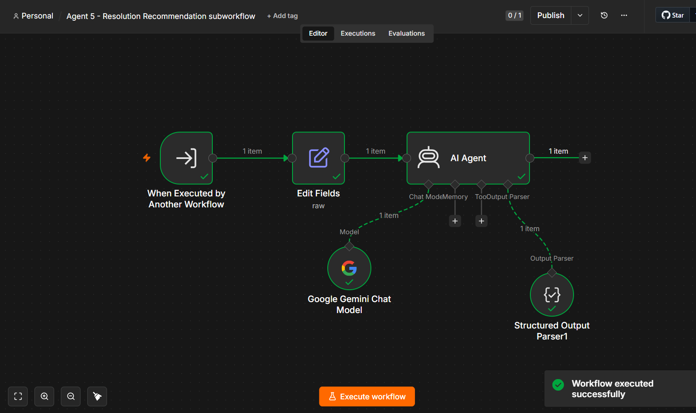

<div align="center">

# 🚀 Enterprise AI Incident Resolution System

### Intelligent Multi-Agent AI Orchestrator for Enterprise IT Incident Management

<p align="center">


</p>

### 🤖 Multi-Agent AI • 🧠 RAG • 📚 Enterprise Knowledge Base • ⚡ Workflow Automation

---

**Enterprise AI Incident Resolution System** is an intelligent **Multi-Agent AI platform** that automates enterprise incident management using **Google Gemini**, **Pinecone Vector Database**, **Retrieval-Augmented Generation (RAG)** and **n8n Workflow Automation**.

Instead of relying on a single AI prompt, the system orchestrates multiple specialized AI agents that collaboratively classify incidents, assess severity, retrieve enterprise knowledge, identify root causes, validate AI reasoning, recommend resolutions, and generate enterprise-ready notifications.

</div>

---

# 📖 Project Overview

Modern organizations handle hundreds or even thousands of IT incidents every day.

Traditional incident management often requires engineers to manually:

- Search internal documentation
- Analyze logs
- Identify root causes
- Recommend fixes
- Notify responsible teams

This process is:

- Time-consuming
- Error-prone
- Inconsistent
- Difficult to scale

This project demonstrates how **Enterprise Multi-Agent AI** can automate the complete incident analysis lifecycle using Retrieval-Augmented Generation (RAG) and AI workflow orchestration.

Instead of a traditional chatbot, this system acts as an **AI Incident Resolution Copilot**, capable of reasoning over enterprise documentation before generating context-aware recommendations.

---

# 🎯 Project Objectives

The primary objectives of this system are to:

- Automatically classify enterprise incidents
- Determine incident severity and business impact
- Retrieve relevant enterprise knowledge using semantic search
- Evaluate retrieved knowledge quality
- Detect multiple incident intents
- Perform AI-powered root cause analysis
- Detect AI hallucinations before generating recommendations
- Recommend intelligent incident resolutions
- Generate enterprise-ready incident notifications
- Reduce Mean Time To Resolution (MTTR)

---

# 🏢 Business Scenario

This project simulates an enterprise financial technology company called **ApexPay FinTech Solutions**.

The organization maintains internal documentation covering:

- Payment Gateway Architecture
- API Authentication
- Database Operations
- Payment Processing Errors
- Incident Runbooks
- Monitoring Procedures
- Escalation Guidelines
- Disaster Recovery Procedures
- Infrastructure Documentation
- Operational Best Practices

Employees submit incidents through a webhook, and the AI system automatically analyzes the issue using internal organizational knowledge before recommending a solution.

---

# ✨ Key Features

## 🤖 Multi-Agent AI Architecture

Nine specialized AI agents collaborate together instead of relying on one large prompt.

---

## 📚 Retrieval-Augmented Generation (RAG)

Retrieves relevant enterprise knowledge from Pinecone before generating responses.

---

## 🔍 Semantic Search

Uses vector embeddings for context-aware knowledge retrieval.

---

## 🧠 Google Gemini Integration

Powered by Google's latest Gemini models for enterprise reasoning.

---

## 📊 Incident Classification

Automatically categorizes enterprise incidents into relevant operational domains.

---

## 🚨 Severity Assessment

Determines:

- Business Impact
- Incident Severity
- SLA Response Time
- Affected Users
- Confidence Score

---

## 🧩 Root Cause Analysis

AI identifies the most probable technical root cause using enterprise knowledge.

---

## 📑 Resolution Recommendation

Generates step-by-step remediation guidance.

---

## 🛡 Hallucination Detection

Validates AI-generated responses before final recommendations.

---

## 📢 Enterprise Notification Generation

Automatically prepares incident notifications for engineering teams.

---

## 📈 Knowledge Quality Evaluation

Evaluates whether retrieved knowledge is:

- Relevant
- Complete
- Reliable

before allowing downstream AI reasoning.

---

## 🧠 Multi Intent Detection

Detects incidents containing multiple failures or cascading issues.

---

# 🏗 Enterprise AI Architecture

```text
                    Enterprise Incident

                           │
                           ▼

                Agent 1 — Incident Classification

                           │
                           ▼

               Agent 2 — Severity Assessment

                           │
                           ▼

            Agent 3 — Knowledge Retrieval (RAG)

                           │
                           ▼

             Agent 7 — Knowledge Evaluation

                           │
                           ▼

               Knowledge Quality Validation

                           │
                           ▼

              Agent 8 — Multi Intent Detection

                           │
                           ▼

               Agent 4 — Root Cause Analysis

                           │
                           ▼

          Agent 9 — Hallucination Detection

                           │
                           ▼

             Hallucination Validation Check

                           │
                           ▼

        Agent 5 — Resolution Recommendation

                           │
                           ▼

         Agent 6 — Notification Generation

                           │
                           ▼

                JSON Response via Webhook
```

---

# 🤖 Multi-Agent Architecture

| Agent | Responsibility | Status |
|--------|---------------|--------|
| Agent 1 | Incident Classification | ✅ |
| Agent 2 | Severity Assessment | ✅ |
| Agent 3 | Knowledge Retrieval (RAG) | ✅ |
| Agent 4 | Root Cause Analysis | ✅ |
| Agent 5 | Resolution Recommendation | ✅ |
| Agent 6 | Notification Generation | ✅ |
| Agent 7 | Knowledge Quality Evaluation | ✅ |
| Agent 8 | Multi Intent Detection | ✅ |
| Agent 9 | Hallucination Detection | ✅ |

---

# 🎯 Enterprise Workflow

```text
Incident

↓

Classification

↓

Severity Assessment

↓

Knowledge Retrieval (Pinecone)

↓

Knowledge Evaluation

↓

Multi Intent Detection

↓

Root Cause Analysis

↓

Hallucination Detection

↓

Resolution Recommendation

↓

Notification Generation

↓

Webhook Response
```

---
# ⚙ Technology Stack

This project combines modern AI technologies, workflow automation, vector databases, and enterprise knowledge retrieval to build a production-style intelligent incident resolution system.

| Category | Technology | Purpose |
|----------|------------|---------|
| AI Model | Google Gemini | Enterprise reasoning and decision making |
| AI Framework | Multi-Agent Architecture | Specialized AI task orchestration |
| Workflow Engine | n8n | AI workflow automation |
| Vector Database | Pinecone | Semantic knowledge retrieval |
| Embeddings | Google Gemini Embeddings | Document vectorization |
| Knowledge Base | Markdown Documents | Enterprise documentation |
| Runtime | Docker | Containerized deployment |
| API | REST Webhook | Incident submission |
| Language | JavaScript | Workflow logic |
| Data Format | JSON | Agent communication |

---

# 📂 Repository Structure

```text
Enterprise-AI-Incident-Resolution-System

│
├── workflows/
│   ├── Enterprise AI Orchestrator.json
│   ├── Agent 1 - Classification.json
│   ├── Agent 2 - Severity Assessment.json
│   ├── Agent 3 - Knowledge Retrieval.json
│   ├── Agent 4 - Root Cause Analysis.json
│   ├── Agent 5 - Resolution Recommendation.json
│   ├── Agent 6 - Notification Generator.json
│   ├── Agent 7 - Knowledge Evaluation.json
│   ├── Agent 8 - Multi Intent Detection.json
│   └── Agent 9 - Hallucination Detection.json
│
├── knowledge-base/
│   ├── payment-api.md
│   ├── authentication.md
│   ├── database.md
│   ├── monitoring.md
│   ├── escalation.md
│   ├── networking.md
│   └── ...
│
├── screenshots/
│
├── architecture/
│
├── docker/
│
├── README.md
│
└── LICENSE
```

---

# 📚 Enterprise Knowledge Base

The Retrieval-Augmented Generation (RAG) pipeline searches an enterprise knowledge base containing internal operational documentation.

Current knowledge includes:

- Company Overview
- Payment Platform Architecture
- Incident Severity Matrix
- Authentication Procedures
- API Troubleshooting
- Database Failures
- Queue Failures
- DNS Issues
- VPN Troubleshooting
- Monitoring Procedures
- Escalation Guidelines
- Disaster Recovery
- Incident Runbooks
- Operational Best Practices

Every document is embedded using **Google Gemini Embeddings** and stored inside **Pinecone Vector Database** for semantic retrieval.

---

# 🔄 Complete Workflow Execution

The complete AI orchestration pipeline follows the sequence below.

```text
Receive Enterprise Incident

↓

Incident Classification

↓

Severity Assessment

↓

Knowledge Retrieval (RAG)

↓

Knowledge Quality Evaluation

↓

Multi Intent Detection

↓

Root Cause Analysis

↓

Hallucination Detection

↓

Resolution Recommendation

↓

Notification Generation

↓

Webhook Response
```

---

# 📡 REST API

The Enterprise AI Incident Resolution System exposes a Webhook endpoint for incident submission.

## Endpoint

```http
POST /webhook/enterprise-ai-orchestrator
```

---

## Sample Request

```json
{
  "incident_id": "INC-1001",
  "title": "Payment API Down",
  "description": "Customers receive HTTP 500 Internal Server Error while processing payments.",
  "service": "Payment Gateway"
}
```

---

## Sample Response

```json
{
  "classification": "Payment System",

  "severity": "Critical",

  "business_impact": "High",

  "knowledge_retrieval": "Relevant",

  "root_cause": "Database connection pool exhausted",

  "recommended_resolution": "Restart payment service and restore database connectivity.",

  "notification_title": "URGENT: Payment API Service Degradation",

  "priority": "Critical",

  "target_team": "Application Team"
}
```

---

# 🛠 Installation Guide

## 1. Clone Repository

```bash
git clone https://github.com/YOUR_USERNAME/Enterprise-AI-Incident-Resolution-System.git
```

---

## 2. Navigate into the project

```bash
cd Enterprise-AI-Incident-Resolution-System
```

---

## 3. Start Docker

```bash
docker compose up -d
```

---

## 4. Open n8n

```
http://localhost:5678
```

---

## 5. Import Workflows

Import all JSON workflow files located in the **workflows/** directory.

---

## 6. Configure Credentials

Create credentials for:

- Google Gemini API
- Pinecone
- Google Drive (optional)

---

## 7. Upload Enterprise Knowledge

Run the ingestion workflow to:

- Read Markdown files
- Chunk documents
- Generate embeddings
- Store vectors inside Pinecone

---

## 8. Start the Enterprise AI Orchestrator

Activate the main workflow and send incidents using the webhook endpoint.

---

# 🔍 AI Processing Pipeline

## Stage 1

Incident Classification

↓

Severity Assessment

---

## Stage 2

Knowledge Retrieval

↓

Knowledge Evaluation

---

## Stage 3

Multi Intent Detection

↓

Root Cause Analysis

↓

Hallucination Detection

---

## Stage 4

Resolution Recommendation

↓

Notification Generation

↓

Webhook Response

---

# 🧠 AI Reasoning Flow

```text
Enterprise Incident

↓

Semantic Search

↓

Retrieve Relevant Knowledge

↓

Context Injection

↓

Google Gemini Reasoning

↓

Root Cause Analysis

↓

Hallucination Validation

↓

Resolution Recommendation

↓

Enterprise Notification
```

---

# 📊 Enterprise Benefits

The system provides several operational advantages.

- Faster Incident Resolution
- Reduced Mean Time To Resolution (MTTR)
- AI-assisted Decision Support
- Consistent Troubleshooting
- Enterprise Knowledge Reuse
- Reduced Human Error
- Automated Incident Analysis
- Intelligent Resolution Recommendations
- Standardized Notifications
- Improved Operational Efficiency
---

# 📸 Project Demonstration

## Workflow Execution

> Add screenshots of your n8n workflow execution.

### Enterprise AI Orchestrator


The Enterprise AI Orchestrator successfully executing the complete multi-agent incident resolution workflow. The workflow classifies incidents, assesses severity, retrieves enterprise knowledge, performs root cause analysis, detects hallucinations, recommends resolutions, and generates structured notifications.


---


### Pinecone Knowledge Retrieval

## 📸 Pinecone Vector Database

The enterprise knowledge base is indexed in Pinecone for semantic retrieval.


---

### AI Resolution Recommendation



---

### Notification Generation

## 📸 AI Notification Output

After completing incident classification, severity assessment, knowledge retrieval, root cause analysis, and resolution recommendation, the AI automatically generates a structured notification for the responsible operations team.

This output includes:

- Incident summary
- Severity level
- Root cause
- Recommended resolution
- Target team
- Communication channel
- Priority


---

## 📸 Enterprise Knowledge Base

The AI assistant retrieves information from an internal enterprise knowledge base containing runbooks, troubleshooting guides, monitoring procedures, and incident response documentation.


# 🧪 Testing & Validation

The system has been tested using multiple enterprise incident scenarios.

| Scenario | Status |
|----------|--------|
| Payment API Failure | ✅ |
| Authentication Failure | ✅ |
| Database Timeout | ✅ |
| Queue Failure | ✅ |
| DNS Resolution Failure | ✅ |
| VPN Connectivity Issue | ✅ |
| Internal Server Error | ✅ |
| Monitoring Alert | ✅ |
| Webhook Failure | ✅ |

---

# 📊 AI Pipeline Validation

The following AI components have been validated.

| Component | Status |
|-----------|--------|
| Classification | ✅ |
| Severity Assessment | ✅ |
| Knowledge Retrieval | ✅ |
| Knowledge Evaluation | ✅ |
| Multi Intent Detection | ✅ |
| Root Cause Analysis | ✅ |
| Hallucination Detection | ✅ |
| Resolution Recommendation | ✅ |
| Notification Generation | ✅ |

---

# 📈 Current Project Status

| Module | Completion |
|---------|------------|
| Multi-Agent Architecture | ✅ Complete |
| Enterprise Workflow | ✅ Complete |
| Google Gemini Integration | ✅ Complete |
| Pinecone Integration | ✅ Complete |
| Retrieval-Augmented Generation | ✅ Complete |
| Root Cause Analysis | ✅ Complete |
| Resolution Recommendation | ✅ Complete |
| Hallucination Detection | ✅ Complete |
| Notification Generator | ✅ Complete |
| Webhook API | ✅ Complete |
| Docker Deployment | ✅ Complete |

---

# 🎯 Skills Demonstrated

This project demonstrates practical experience in:

## Artificial Intelligence

- Multi-Agent AI Systems
- Retrieval-Augmented Generation (RAG)
- Prompt Engineering
- Large Language Models (LLMs)
- AI Workflow Orchestration
- Hallucination Detection

---

## Enterprise Automation

- Workflow Automation
- Business Process Automation
- Incident Response Automation
- AI Decision Support

---

## Vector Databases

- Pinecone
- Semantic Search
- Embeddings
- Similarity Search

---

## Cloud & DevOps

- Docker
- REST APIs
- Webhooks
- JSON
- Enterprise Integrations

---

## Software Engineering

- System Architecture
- Enterprise Application Design
- API Integration
- Modular Workflow Design
- Documentation

---

# 💼 Business Value

The system provides measurable business value by:

- Reducing Mean Time To Resolution (MTTR)
- Improving incident response consistency
- Automating repetitive troubleshooting tasks
- Reusing organizational knowledge
- Supporting engineering teams with AI-assisted decision making
- Standardizing incident notifications

---

# 🚀 Future Roadmap

Planned future enhancements include:

- ServiceNow Integration
- Jira Integration
- Slack Notifications
- Microsoft Teams Integration
- Email Notification Support
- Human-in-the-loop Approval
- Feedback-based Learning
- Dashboard & Analytics
- Incident History Database
- Performance Monitoring
- Kubernetes Deployment
- Cloud Deployment (AWS/Azure/GCP)

---

# 🏆 Project Highlights

✔ Enterprise Multi-Agent AI Architecture

✔ Retrieval-Augmented Generation (RAG)

✔ Google Gemini Integration

✔ Pinecone Vector Database

✔ Knowledge Quality Evaluation

✔ AI Hallucination Detection

✔ Root Cause Analysis

✔ Intelligent Resolution Recommendation

✔ Enterprise Notification Generation

✔ Automated Incident Workflow

---
## Results

- 13 Enterprise Runbooks
- 49 Vector Chunks indexed
- 9 AI Agents
- Google Gemini 2.5 Flash
- Pinecone Vector Database
- End-to-End Enterprise Workflow
---

# 📚 References

- Google Gemini API
- Pinecone Vector Database
- n8n Documentation
- Retrieval-Augmented Generation (RAG)
- LangChain Concepts
- Enterprise Incident Management Best Practices

---

# 🤝 Contributing

Contributions, ideas, and suggestions are welcome.

If you'd like to improve this project:

1. Fork the repository.
2. Create a new feature branch.
3. Commit your changes.
4. Submit a Pull Request.

---

# 👩‍💻 Author

## **Yashadhi Jayasundara**

Information Technology Undergraduate

### Areas of Interest

- Artificial Intelligence
- Multi-Agent Systems
- Enterprise Automation
- Workflow Engineering
- Retrieval-Augmented Generation (RAG)
- Prompt Engineering

---

## Connect With Me

- GitHub: https://github.com/YOUR_USERNAME
- LinkedIn: https://linkedin.com/in/YOUR_PROFILE

---

# ⭐ If you found this project useful...

Please consider giving this repository a ⭐ on GitHub.

It helps support the project and encourages future improvements.

---

# 📄 License

This project is licensed under the MIT License.

See the **LICENSE** file for more information.

---

<div align="center">

## 🚀 Enterprise AI Incident Resolution System

### Built with ❤️ using

**Google Gemini • Pinecone • n8n • Docker • Multi-Agent AI • Retrieval-Augmented Generation**

---

**Thank you for visiting this repository!**

</div>